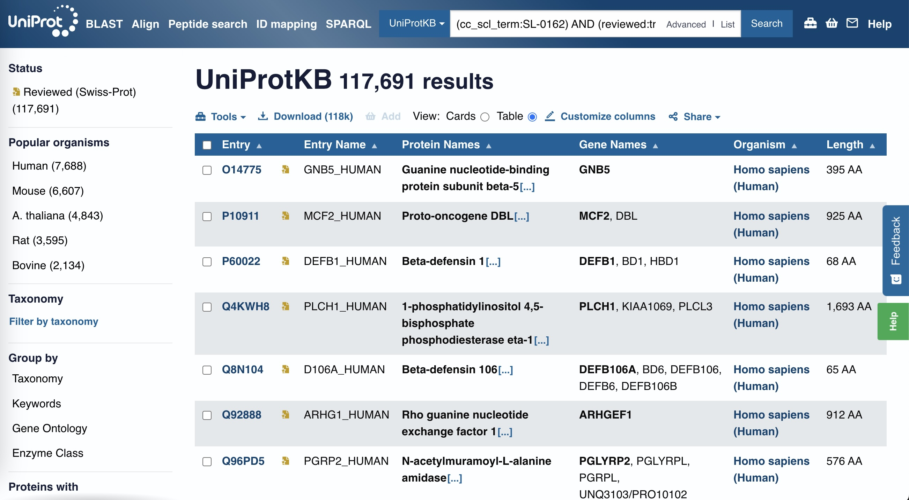
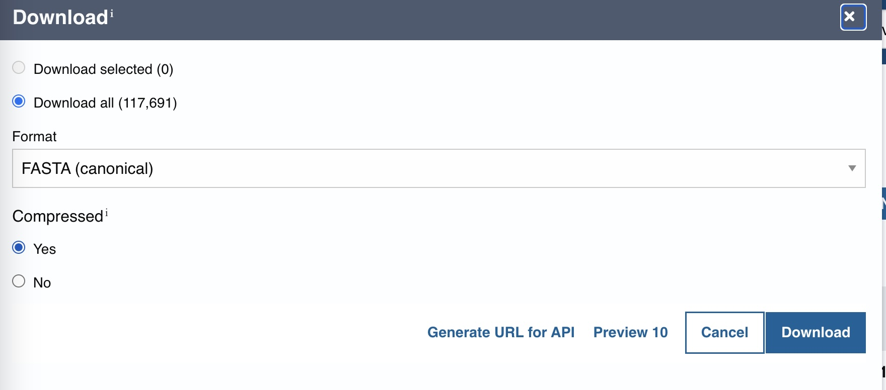

# IDRs in membrane proteins

### About
The writeup below walks through how to answer the question "what fraction of membrane proteins have IDRs".

The tl/dr: on average **55% of membrane proteins [as defined here] have IDRs**.

### Data
This directory (WITH the associated sequences), which are not included on GitHub, [are deposited on Zenodo with DOI https://doi.org/10.5281/zenodo.14060470](https://doi.org/10.5281/zenodo.14060470)

## Steps

#### Install software
Install metapredict

	pip install metapredict
	
Done.

#### Find the data
	
Using the "Advanced Search", I downloaded all reviewed proteins on [UniProt](https://uniprot.org/) tagged as having a "membrane" subcellular localization. 

There are, of course, much more detailed ways one could get these data (e.g., requiring transmembrane helices, integral membrane protein filtering etc, etc), but I figured for purposes here, I'd just do this...

Screenshot of what this search looks like below for completeness.
 

 

#### Download the data
Running this search returns the following page:  

 
From this, I downloaded all the FASTA sequences ("Downloads" link on here).

 

 

This triggers the following file to be downloaded:

	uniprotkb_cc_scl_term_SL_0162_AND_revie_2024_11_09.fasta

#### Preprocessing the data	
Next I wanted to fix any sequences with non-standard amino acids by converting those residues to "standard" amino acids. I did this using `pfasta`, a commandline tool that's part of [protfasta](https://protfasta.readthedocs.io/en/latest/) which comes with metapredict.

Did this simply with

	pfasta --invalid-sequence convert-all -o membrane_proteins.fasta uniprotkb_cc_scl_term_SL_0162_AND_revie_2024_11_08.fasta
	
* The `--invalid-sequence` flag tells pfasta what to with an invalid sequence, and `-o` tells it what the ouput file should be called.

Running this (~5 seconds) generates the following output:

	........................
	pfasta version 0.1.13+0.gc1786bd.dirty
	Please report bugs to:
	https://github.com/holehouse-lab/protfasta
	........................
	
	[INFO]: Reading in the file uniprotkb_cc_scl_term_SL_0162_AND_revie_2024_11_08.fasta
	[INFO]: Read in file with 1004330 lines
	[INFO]: Parsed file to recover 117691 sequences
	[INFO]: Converted 697 sequences to valid sequences
	[INFO]: Writing new sequence file [membrane_proteins.fasta]...
	
	
#### Predicting all IDRs
Run one of metapredict's command-line utilities to predict all IDRs in these proteins.

	metapredict-predict-idrs membrane_proteins.fasta  -o membrane_protein_idrs.fasta
	
	
This takes ~20 seconds on my desktop with an A4500 GPU or ~5 min with my Macbook Pro. We're then left with a file called `membrane_protein_idrs.fasta`. This is a FASTA file that the header format:

	><HEADER FOR ORIGINAL PROTEIN> IDR_START=<start position> IDR_END=<end_position>
	
e.g. 

	>sp|B4R1D8|HH_DROSI Protein hedgehog OS=Drosophila simulans OX=7240 GN=hh PE=3 SV=1 IDR_START=0 IDR_END=94
	MDNHSSVPWASAASVTCLSLDAKCHSSSSSCSSKSTASSISASPETQTMRHIAHTQRCLS
	RLTSLVALLLIVLPMMFSPAHSCGPGRGLGRHRA
	
		
### Hacky way to get number of proteins with IDRs

Get the number of unique proteins in the main file:

	cat membrane_proteins.fasta | grep ">" | awk -F "|" {' print $2 '} | sort | uniq |wc
	

	
Which returns

	117691  117691  829609
	
So we have 117,691 unique proteins (NB: we could also just have gotten this without the `awk -F "|" {' print $2 '} | sort | uniq` part BUT we do need that for the number of unique proteins with IDRs so good to be consistent.

	cat membrane_protein_idrs.fasta | grep ">" | awk -F "|" {' print $2 '} | sort | uniq |wc
	
Which returns

	64971   64971  458829	
	
So on average **55% of membrane proteins [as defined here] have IDRs**.

### Bonus!
In addition we can predict all disorder scores rather than discrete IDRs using

	metapredict-predict-disorder membrane_proteins.fasta  -o membrane_protein_disorder_scores.csv
	
This takes ~5 min on my Macbook Pro. The data for these are included here for completeness/convenience. 	
	