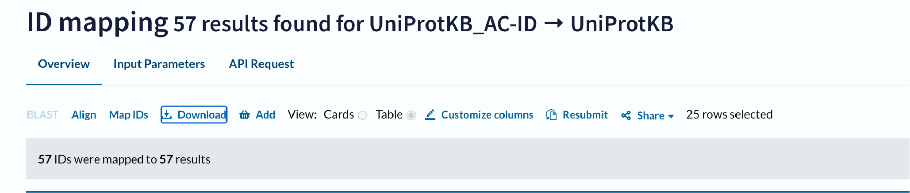
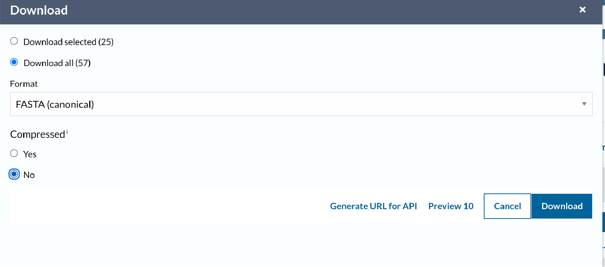

# Calculating statistics on lists of genes
#### Last updated 2024-07-29

This quick walkthrough explains how you can calculate what fraction of a list of proteins contain disordered regions, where disorder here is predicted using [metapredict (V2-FF)](https://www.nature.com/articles/s41592-023-02159-5).

We assume you're starting with a list of gene names or protein identifiers. If you already have your sequences in a FASTA file, head to Step 3.

### Step 1 - map your sequences!
First up, head to the [UniProt ID mapping service](https://www.uniprot.org/id-mapping) and paste in your list of gene/protein identifiers (selecting the appropriate database to pull from). If you have gene names you'll need to specify the organism of interest. In general UniProt IDs are the safest to use here if you can get 'em.

### Step 2 - download your sequences!
Having uploaded your identifiers, these will be mapped, and HOPEFULLY, every ID will be identified in UniProtKB and mapped to an amino acid sequence. This will take you to a screen with a bunch of options, but all you want to do is download the FASTA file for your sequences. Click on the Download button, as shown below:

and then you'll be greeted with the Download popout. Select "Download all", format "FASTA (canonical)", and then Compressed "No" for simplicity:

### Step 3 - predict fraction disordered
[Pop on over to here](https://github.com/holehouse-lab/supportingdata/blob/master/other/fraction_disordered/fraction_disordered_across_list_of_proteins.ipynb) and open this notebook in Google colab. This will let you upload a FASTA file and calculate:

1. Fraction of proteins with disordered regions.
2. Average disorder across all proteins (mean,median,min,max)
3. Average NUMBER of disordered residues across all proteins (mean,median,min,max)

If more involved informatics are of interest, this can probably be done, just shoot Alex a message!
 